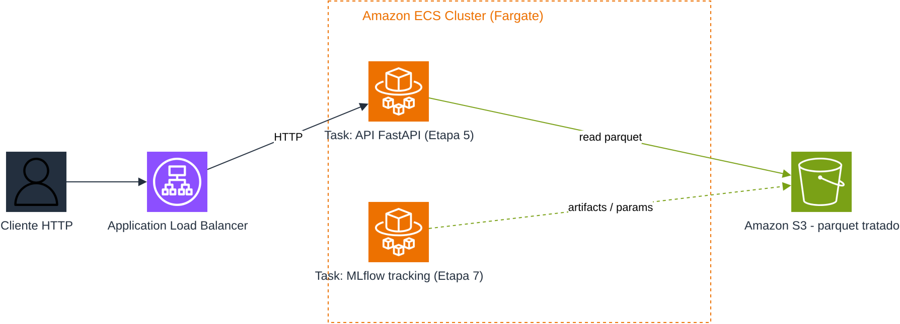

# Datathon MLET — FIAP POSTECH

## Visão geral

Projeto acadêmico final da pós-graduação em Machine Learning Engineering da FIAP
POSTECH. O Datathon propõe uma solução end-to-end para apoiar a escolha
adaptativa de um canal, oferta, mensagem ou próximo passo para clientes elegíveis
de uma instituição financeira.

Etapas 0-7 concluídas — checklist completo no final deste README.

## Problema de negócio

Uma instituição financeira precisa decidir como abordar cada cliente elegível sem
depender apenas de uma estratégia fixa. A decisão deve considerar o contexto
disponível e permitir aprendizado controlado a partir das respostas observadas,
respeitando privacidade, governança e limitações de inferência.

## Objetivo da solução

Construímos e avaliamos uma solução reprodutível que compara uma política
fixa (baseline) com uma política adaptativa (Thompson Sampling) para
recomendar o canal de contato (`cellular`/`telephone`) a cada cliente
elegível.

## Base de dados

A base escolhida é o conjunto público
[Bank Marketing, no Kaggle](https://www.kaggle.com/datasets/henriqueyamahata/bank-marketing/data)
(`henriqueyamahata/bank-marketing`). O arquivo usado é `bank-additional-full.csv`
(41.188 linhas, 21 colunas), e a variável-alvo é `y`, que indica adesão a um
depósito a prazo (`p̂ = 0.1127`, base desbalanceada ~89/11). O download é feito
via `kagglehub` no notebook `notebooks/01_eda.ipynb`; o dataset não é versionado
(`data/raw/` e `data/processed/` são ignorados pelo Git, exceto `.gitkeep`).

## Formulação

- **Contexto:** atributos do cliente conhecidos antes da decisão (17
  colunas — ver Etapa 2).
- **Braço:** canal de contato, `cellular` ou `telephone` (coluna
  `contact`) — não produto/oferta, ver justificativa abaixo.
- **Recompensa:** `y` binarizado (`yes` → 1, `no` → 0).
- **Baseline:** regra fixa arbitrária, sempre `telephone` — não "melhor
  canal histórico" (ver Etapa 3).
- **Política adaptativa:** Thompson Sampling Beta-Bernoulli.

A EDA (`notebooks/01_eda.ipynb`) confirma um gap de conversão real entre
canais (`cellular` 14,7% vs `telephone` 5,2%), mas confundido com regime
econômico (`telephone` concentra contatos no período de crise 2008–2010)
— por isso tratado como associação observacional, não causal.

**Por que o braço é canal, não oferta:** a base testa uma única oferta
(depósito a prazo) em toda a campanha, sem coluna de produto alternativo
— canal é a única dimensão de decisão que os dados sustentam. Decisão
completa: `docs/decisions/004-formulacao-braco-canal-vs-oferta.md`.

## Preparação da base (Etapa 2)

`src/datathon_mlet/data_prep.py` transforma o dataset tratado da Etapa 1 em
contexto, ação e recompensa (`PreparedDataset`, em
`src/datathon_mlet/models.py`), consumido por `notebooks/02_preparacao.ipynb`:

- **`context`** (17 colunas): todas as features do cliente, exceto `contact`
  (é a ação), `y` (é o alvo) e `emp.var.rate`/`nr.employed` (redundantes com
  `euribor3m`, correlação 0,91–0,97 — ver EDA);
- **`action`**: a coluna `contact` (`cellular`/`telephone`), o braço do
  bandit;
- **`reward`**: `y` binarizado (`yes` → 1, `no` → 0).

A função falha explicitamente (`ValueError`) se `duration` estiver presente,
evitando reintroduzir vazamento por engano. Decisão de arquitetura
completa: `docs/decisions/001-etapa2-preparacao-arquitetura.md`.

## Baseline e estratégia algorítmica (Etapa 3)

`notebooks/03_baseline_vs_ts.ipynb` compara um baseline determinístico com
uma política adaptativa, avaliados via método de replay
(`src/datathon_mlet/replay.py`) sobre o histórico preparado na Etapa 2:

- **Baseline** (`FixedPolicy`, `src/datathon_mlet/policies.py`): regra fixa
  arbitrária — sempre `telephone` (5,23% de conversão histórica), simulando
  uma decisão herdada sem análise de dado por trás;
- **Política adaptativa** (`ThompsonSamplingPolicy`): Thompson Sampling
  Beta-Bernoulli, `Beta(1,1)` por braço (`cellular`/`telephone`), sem uso do
  contexto do cliente (bandit não-contextual — decisão registrada);
- **Avaliação**: método de replay (Li et al., 2011) — só conta uma rodada
  quando a ação escolhida pela política coincide com o canal real do
  cliente no histórico; sem contrafactual inventado.

**Resultado** (20 seeds para o Thompson Sampling; baseline é
determinístico): baseline = 5,23% de conversão; Thompson Sampling = 14,69%
± 0,02 p.p. — ganho de aproximadamente 2,8×.

Baseline é regra fixa arbitrária, não "melhor canal histórico" — esse
segundo critério empataria com o Thompson Sampling, por ser um oráculo
(nenhuma política que precisa explorar o supera). Avaliação por replay
sobre dado observacional (canal não foi sorteado aleatoriamente) — o
resultado é uma associação, não um efeito causal. Decisão e alternativas
consideradas: `docs/decisions/002-etapa3-baseline-e-replay.md`.

## Avaliação e Golden Set (Etapa 4)

`notebooks/04_avaliacao_golden_set.ipynb` completa a avaliação da Etapa 3
com uma métrica adicional e um conjunto de teste com clientes reais:

- **Regret médio por rodada** (`taxa_oráculo - taxa_política`, oráculo =
  `cellular`, 14,74%): baseline fica 9,51 p.p. atrás; Thompson Sampling
  fica apenas 0,03 p.p. atrás — praticamente ótimo.
- **Golden Set**: 5 clientes reais (`poutcome` variado) — a política
  recomenda `cellular` pros 5 (esperado, bandit não-contextual). Um caso
  (campanha anterior malsucedida + `telephone`) converteu mesmo assim —
  ruído individual que uma extensão contextual (contexto já preparado na
  Etapa 2) capturaria melhor.

## Serviço demonstrável (Etapa 5)

API FastAPI que recebe os dados de um cliente e retorna o canal
recomendado, organizada em 3 camadas (`src/datathon_mlet/`):

- `api/entrypoints/main.py` — app FastAPI, rotas (`GET /health`,
  `POST /recommendations`), carrega a política do MLflow no startup;
- `api/schemas.py` — `ClientContext` (as 17 colunas de contexto da Etapa 2)
  e `RecommendationResponse`, validação na fronteira;
- `use_cases.py` — `recommend_channel(policy)`, lógica de aplicação
  desacoplada de HTTP/Pydantic, reaproveitável por outro tipo de entrypoint
  (script, CLI) sem duplicar código;
- `policy_store.py` — `log_policy` / `load_latest_policy`, publicação e
  carga da política no MLflow.

A API **não treina nada no startup** — carrega a política publicada mais
recente no MLflow (`make publish-policy` publica uma nova versão). Sem
MLflow acessível ou sem nada publicado, o startup falha explicitamente
(sem fallback silencioso). Bandit não-contextual: a recomendação hoje
independe do payload do cliente (contrato já aceita contexto para uma
extensão futura). Decisões: `docs/decisions/003-etapa5-api-arquitetura.md`,
`docs/decisions/007-api-carrega-policy-do-mlflow.md`.

### Rodando localmente

O MLflow precisa estar no ar e ter uma política publicada (ver "Ciclo de
vida MLOps" abaixo):

```bash
docker compose up -d mlflow
make publish-policy  # só na 1ª vez ou ao republicar
uv run uvicorn datathon_mlet.api.entrypoints.main:app --reload --port 8081
```

### Rodando com Docker

A imagem não define um comando padrão (`CMD`) — fica genérica para ser
reaproveitada por outros serviços que rodam o mesmo código-fonte (a API e o
MLflow saem da mesma imagem), com o comando de start explícito no
`docker-compose.yml`. Como a API depende do MLflow, o caminho recomendado é
subir os dois pelo compose:

```bash
docker compose up -d mlflow
make publish-policy  # só na 1ª vez ou ao republicar
docker compose up -d api
```

O serviço `api` espera o healthcheck do `mlflow` passar antes de subir e
recebe `MLFLOW_TRACKING_URI=http://mlflow:5000` (nome do serviço na rede do
compose — de dentro do container, `localhost` seria o próprio container).

Teste rápido:

```bash
curl http://127.0.0.1:8081/health

curl -X POST http://127.0.0.1:8081/recommendations \
  -H "Content-Type: application/json" \
  -d '{"age": 37, "job": "admin.", "marital": "married", "education": "university.degree", "default": "no", "housing": "no", "loan": "no", "month": "may", "day_of_week": "mon", "campaign": 1, "pdays": 999, "previous": 0, "poutcome": "nonexistent", "cons.price.idx": 93.994, "cons.conf.idx": -36.4, "euribor3m": 4.857, "foi_contatado_antes": false}'
```

## Arquitetura-alvo em nuvem (Etapa 6)

Como solução de arquitetura em nuvem pública (AWS) para o container
validado na Etapa 5, optamos por:

- **Compute — Amazon ECS (Fargate).** Mesma imagem Docker da Etapa 5, sem
  adaptação; um cluster comporta API e MLflow como serviços separados —
  o equivalente em nuvem do `docker-compose` local (Etapa 7). Lambda
  descartado (MLflow precisa de processo persistente, incompatível com
  execução sob demanda); App Runner descartado (parou de aceitar novos
  clientes em 2026, AWS recomenda ECS como sucessor).
- **Dado — Amazon S3.** Substitui o volume local do parquet tratado;
  leitura em lote não exige banco transacional (RDS).
- Nenhum código foi alterado nesta etapa — é só o desenho da
  arquitetura-alvo, sem deploy real.



Fonte editável em `docs/diagrams/etapa6-arquitetura-aws.drawio` (abra em
[diagrams.net](https://app.diagrams.net)). Alternativas descartadas e
justificativa completa: `docs/decisions/005-etapa6-arquitetura-aws.md`.

## Ciclo de vida MLOps (Etapa 7)

MLflow local registra os parâmetros/métricas dos experimentos da Etapa 3 e
também guarda a política que a API serve (Etapa 5) — em vez de números
soltos em notebook ou retreino a cada startup.

- **Servidor via `docker-compose`**, não tracking em arquivo (MLflow 3.x
  descontinuou esse backend para o `mlflow server`) — backend SQLite
  local. Reusa a mesma imagem Docker da API, só troca o `command:`.
- **Instrumentação em `src/datathon_mlet/experiments.py`**, não no
  notebook: `log_baseline_vs_thompson_sampling` reusa `run_replay` e loga
  1 run pro baseline + 1 run pai/N aninhados (1 por seed) pro Thompson
  Sampling, com os agregados (média/desvio-padrão) no pai.
- **Política publicada como artifact simples** (`policy_store.py`, pickle
  num run), sem MLflow Model Registry — com 1 modelo e 1 consumidor, o
  Registry não traria ganho e exigiria um wrapper `pyfunc` só pra formato
  (a política não é um estimador scikit-learn).

Decisões completas: `docs/decisions/006-etapa7-mlflow.md`,
`docs/decisions/007-api-carrega-policy-do-mlflow.md`.

### Rodando

```bash
cp .env.example .env  # ajuste MLFLOW_TRACKING_URI se o servidor não for local
docker compose up -d mlflow
make publish-policy
```

Abra <http://localhost:5000> para ver os experimentos e a política
publicada. Para gerar ou atualizar as métricas de avaliação, rode
`notebooks/03_baseline_vs_ts.ipynb`; para publicar uma nova versão da
política que a API serve, rode `make publish-policy` de novo e reinicie a
API. Ambos leem `MLFLOW_TRACKING_URI` (o notebook via `.env` com
`python-dotenv`, a API via variável de ambiente do container), com
fallback para `http://localhost:5000`.

Para subir API e MLflow juntos (com uma política já publicada
anteriormente): `make run`. A API espera o healthcheck do MLflow, mas
ainda precisa de uma política já publicada para subir com sucesso.

## Stack tecnológica

- Python 3.11;
- pandas, NumPy e scikit-learn;
- MLflow;
- FastAPI, Uvicorn e Pydantic;
- Jupyter, matplotlib e seaborn;
- pytest, HTTPX e Ruff;
- pre-commit (Ruff + testes) e GitHub Actions para integração contínua;
- AWS como arquitetura-alvo futura;
- `uv` para ambiente e dependências.

## Estrutura do repositório

```text
.
├── .github/workflows/      # CI (GitHub Actions — testes a cada push na main)
├── artifacts/              # artefatos gerados (não versionados)
├── data/
│   ├── processed/          # dados processados (não versionados)
│   └── raw/                # dados brutos (não versionados)
├── docs/
│   ├── decisions/          # ADRs — decisões de arquitetura e metodologia
│   └── diagrams/           # diagramas (ex. arquitetura-alvo AWS)
├── notebooks/              # notebooks definitivos do projeto
├── src/datathon_mlet/      # pacote Python (domínio, API, MLflow)
├── tests/                  # testes automatizados
├── .env.example
├── .gitignore
├── .pre-commit-config.yaml
├── .python-version
├── docker-compose.yml      # API + MLflow (Etapas 5 e 7)
├── Dockerfile              # imagem única, reaproveitada pelos dois serviços
├── Makefile
├── pyproject.toml
└── README.md
```

Os diretórios vazios são mantidos no Git por arquivos `.gitkeep`; dados e
artefatos adicionados a eles permanecem ignorados.

## Instalação e execução local

Há dois caminhos de instalação. O caminho com `uv` é o recomendado por oferecer
um fluxo mais rápido e reprodutível. Escolha apenas um dos caminhos e não misture
seus comandos durante a mesma instalação.

### Caminho recomendado — uv

O [`uv`](https://docs.astral.sh/uv/) é um gerenciador de projetos, ambientes e
dependências Python. O comando `uv sync` cria e gerencia automaticamente o
ambiente `.venv`; portanto, não execute `python -m venv .venv` antes dele.

Instale o `uv` de acordo com seu sistema operacional.

#### Linux

```bash
curl -LsSf https://astral.sh/uv/install.sh | sh
```

#### macOS

Com Homebrew:

```bash
brew install uv
```

Como alternativa, use o instalador oficial:

```bash
curl -LsSf https://astral.sh/uv/install.sh | sh
```

#### Windows com WinGet

```powershell
winget install --id=astral-sh.uv -e
```

#### Windows com PowerShell

```powershell
powershell -ExecutionPolicy ByPass -c "irm https://astral.sh/uv/install.ps1 | iex"
```

Após instalar o `uv`, clone o projeto, instale as dependências de execução e de
desenvolvimento e execute as validações:

```bash
git clone <URL_DO_REPOSITORIO>
cd datathon-7mlet-grupo-18

uv sync --extra dev
uv run pytest
uv run ruff check .
uv run pre-commit install
```

Nesse fluxo:

- `.venv/` é criado e gerenciado automaticamente pelo `uv`;
- `pyproject.toml` declara as dependências do projeto;
- `uv.lock` registra as versões exatas resolvidas e deve ser versionado;
- `.venv/` é um diretório local e não deve ser versionado;
- os comandos do projeto devem ser executados preferencialmente com `uv run`;
- `uv run pre-commit install` ativa o hook de pré-commit (`.pre-commit-config.yaml`:
  Ruff + suíte de testes) neste clone — rodar 1x após instalar. Pra rodar
  os mesmos checks sob demanda (sem esperar um commit): `make pre-commit`.
  O mesmo comando roda no CI (`.github/workflows/ci.yml`) a cada push na
  `main`.

### Notebook de EDA

Com o ambiente instalado (`uv sync --extra dev` ou equivalente), rode:

```bash
uv run jupyter notebook notebooks/01_eda.ipynb
```

A primeira célula de download baixa a base via `kagglehub` — se pedir
autenticação, configure `~/.kaggle/kaggle.json` ou use `kagglehub.login()`. O
notebook gera `data/processed/bank_marketing_clean.parquet`, consumido pelas
próximas etapas.

### Caminho alternativo — venv e pip

Esse caminho usa as ferramentas tradicionais incluídas no Python. O extra de
desenvolvimento `dev`, declarado no `pyproject.toml`, instala os recursos de
notebooks, testes, lint e visualização.

#### Linux e macOS

```bash
git clone <URL_DO_REPOSITORIO>
cd datathon-7mlet-grupo-18

python3 -m venv .venv
source .venv/bin/activate

python -m pip install --upgrade pip
python -m pip install -e ".[dev]"

pytest
ruff check .
pre-commit install
```

Dependendo da instalação do Python, o executável pode se chamar `python` em vez
de `python3`. Nesse caso, crie o ambiente com:

```bash
python -m venv .venv
```

#### Windows PowerShell

```powershell
git clone <URL_DO_REPOSITORIO>
cd datathon-7mlet-grupo-18

py -m venv .venv
.venv\Scripts\Activate.ps1

python -m pip install --upgrade pip
python -m pip install -e ".[dev]"

pytest
ruff check .
pre-commit install
```

#### Windows Prompt de Comando

Para criar e ativar o ambiente no Prompt de Comando (`cmd`), use:

```cmd
py -m venv .venv
.venv\Scripts\activate.bat
```

Depois de ativá-lo, execute os mesmos comandos `pip`, `pytest`, `ruff` e
`pre-commit` mostrados no fluxo do PowerShell. Para sair do ambiente virtual em qualquer sistema:

```bash
deactivate
```

### Verificação e solução de problemas

Confira as ferramentas disponíveis com:

```bash
python --version
uv --version
```

O projeto exige Python **3.11 ou superior e anterior ao Python 3.14**, conforme
`requires-python = ">=3.11,<3.14"` no `pyproject.toml`.

- Se `uv` não for encontrado logo após a instalação, feche e abra novamente o
  terminal para atualizar o `PATH`.
- Nunca versione `.venv/`; o diretório já está protegido pelo `.gitignore`.
- Nunca coloque credenciais do Kaggle ou da AWS no README ou em outros arquivos
  versionados.
- Não misture os comandos do caminho `uv` com os do caminho `venv` e `pip` na
  mesma instalação.
- Para instalação, atualização e diagnóstico do `uv`, consulte a
  [documentação oficial](https://docs.astral.sh/uv/).

## Privacidade, governança e limitações

- Dados reais de clientes não serão utilizados; o trabalho usará apenas a base
  pública selecionada e dados permitidos pelo enunciado.
- Atributos proibidos pelo enunciado não serão usados.
- A coluna `duration` foi excluída das features por representar vazamento
  temporal: seu valor só é conhecido após a interação.
- `pdays` foi binarizada (`foi_contatado_antes`) por conter um valor sentinela
  (999 = "nunca contatado antes") em 96,3% das linhas, incompatível com
  tratamento como escala numérica contínua.
- Ausência de dado é codificada no dataset original como categoria
  `"unknown"`, não como nulo técnico; ela é mantida como categoria própria
  (não imputada), já que em `default` chega a 20,9% das linhas.
- O gap de conversão observado entre canais de `contact` está confundido com
  regime econômico (ver "Formulação inicial") e é reportado como associação,
  não como efeito causal.
- Resultados de simulação não serão apresentados como evidência causal.
- Dados brutos, dados processados, credenciais, execuções locais do MLflow e
  artefatos gerados não devem ser versionados.
- A formulação, os critérios de elegibilidade, os riscos de viés e as hipóteses de
  avaliação serão documentados e revistos ao longo do projeto.

## Integrantes

- Henrico Bela
- André Leone da Silva
- Walicen Rangel Nunes Dalazuana
- Leandro Santana
- Phillipe Tramontano Santos

## Checklist do projeto

Etapas conforme enunciado oficial do Datathon (`docs/POSTECH - MLET -
DATATHON.pdf`):

- [x] Etapa 0 — Organização do projeto
- [x] Etapa 1 — Base Kaggle e EDA
- [x] Etapa 2 — Preparação da base
- [x] Etapa 3 — Baseline e estratégia algorítmica
- [x] Etapa 4 — Avaliação e casos de teste
- [x] Etapa 5 — Serviço ou interface demonstrável
- [x] Etapa 6 — Arquitetura-alvo em nuvem
- [x] Etapa 7 — Ciclo de vida MLOps
